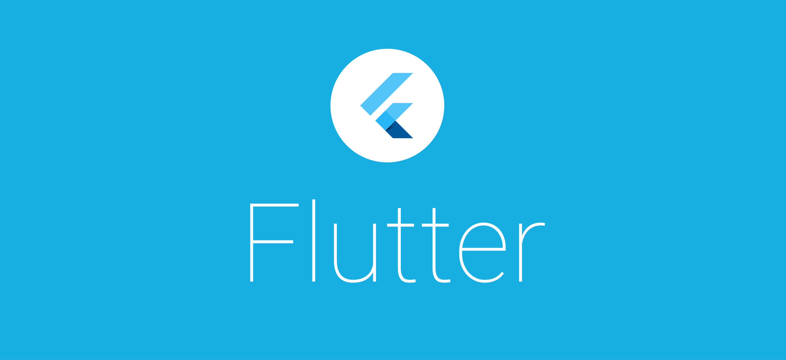

<h1 align="center">
    
</h1>

<h4 align="center">
  Flutter and Dart 💙 | Free Courses 🆓 | Series | Presentations
</h4>

  
  
  

  

  

  <a href="#english">Content in English</a>&nbsp;&nbsp;&nbsp;|&nbsp;&nbsp;&nbsp;
  <a href="#português">Conteúdo em Portugûes</a>&nbsp;&nbsp;&nbsp;|&nbsp;&nbsp;&nbsp;
  <a href="#espanol">Contenido en Español</a>&nbsp;&nbsp;&nbsp;|&nbsp;&nbsp;&nbsp;
  <a href="#thanks">Thanks</a>&nbsp;&nbsp;&nbsp;|&nbsp;&nbsp;&nbsp;
  <a href="#license">License</a>

## English

The best courses and series about Flutter and Dart available. Totally free!

YouTube:

- [How to Build Flutter Apps for iOS and Android](https://www.youtube.com/playlist?list=PLSzsOkUDsvdtl3Pw48-R8lcK2oYkk40cm) by London App Brewery
- [Flutter Crash Course for Beginners 2020](https://youtu.be/x0uinJvhNxI) by Academind
- [Flutter Tutorial for Beginners](https://www.youtube.com/playlist?list=PL4cUxeGkcC9jLYyp2Aoh6hcWuxFDX6PBJ) by The Net Ninja
- [Flutter Crash Course](https://youtu.be/1gDhl4leEzA) by Traversy Media
- [Flutter Tutorial Course](https://youtu.be/ZWy9BPBE9E8) by Build Apps With Paulo
- [Flutter TDD Clean Architecture](https://www.youtube.com/playlist?list=PLB6lc7nQ1n4iYGE_khpXRdJkJEp9WOech) by Reso Coder
- [Flutter Firebase & DDD](https://www.youtube.com/playlist?list=PLB6lc7nQ1n4iS5p-IezFFgqP6YvAJy84U) by Reso Coder
- [Flare Vector Animation: Zero to Hero](https://www.youtube.com/playlist?list=PLjr4ufdmNA4Jt19RyRQPD7cMF0r0juDs8) by Fun with Flutter
- [Flutter REST API Crash Course](https://www.youtube.com/playlist?list=PLNnAcB93JKV_BVgWZn7I_ewWKP2hpAqLr) by Code With Andrea
- [Dart Language](https://www.youtube.com/playlist?list=PLNnAcB93JKV_BVgWZn7I_ewWKP2hpAqLr) by Code With Andrea
- [Flutter Provider](https://www.youtube.com/playlist?list=PLNnAcB93JKV-IarNvMKJv85nmr5nyZis8) by Code With Andrea
- [Flutter & Firebase authentication](https://www.youtube.com/playlist?list=PLNnAcB93JKV_NIGSneTazb9yMpILapEjo) by Code With Andrea
- [Flutter: Custom Wave Slider](https://www.youtube.com/playlist?list=PLjr4ufdmNA4J2-KwMutexAjjf_VmjL1eH) by Fun with Flutter
- [Flutter Bloc Cryptocurrency App Tutorial](https://www.youtube.com/playlist?list=PLzOt3noWLMtgmTGBx1_YOkmQB0pBFN2EI) by Marcus Ng
- [Farmer's Market Mobile Ordering Application](https://www.youtube.com/playlist?list=PLKlZdGMAYp6_HALU6jMYhaD3EKsIi0Rqy) by Andy Julow
- [Flutter Provider Package](https://www.youtube.com/playlist?list=PLKlZdGMAYp6_kxMe1wg5nB_GrLOJe-ajY) by Andy Julow
- [Flutter Departure Board with BLoC and Provider](https://www.youtube.com/playlist?list=PLKlZdGMAYp6-t9d88iN5sc1fF9tnzskp7) by Andy Julow
- [Flutter Contact App with BLoC and HTTP](https://www.youtube.com/playlist?list=PLKlZdGMAYp6-M7zgBHZSqSzXtKzaY7m_2) by Andy Julow
- [Flutter Parking Locator with Google Maps](https://www.youtube.com/playlist?list=PLKlZdGMAYp6_cpXFIhv3nLTZeFClrORoY) by Andy Julow
- [Flutter Devfest App Tutorials](https://www.youtube.com/playlist?list=PLR2qQy0Zxs_Vju3tKnYgzbAhywHHPuDjQ) by MTECHVIRAL
- [Flutter Widget Essentials - Widgets in Detail](https://www.youtube.com/playlist?list=PLybADvIp2cxiVOEHi9ooCHP2tAAihHQPX) by RetroPortal Studio
- [Build a Fully Functioning Chat App with Flutter & Firebase](https://www.youtube.com/playlist?list=PLBxWkM8PLHcr2vkdY2n9rIcxjZ9Th3Us7) by Sanskar Tiwari
- [Flutter Architecture](https://www.youtube.com/playlist?list=PLdTodMosi-BwM4XkagNwe4KADOMWQS5X-) by FilledStacks
- [Flutter Firebase](https://www.youtube.com/playlist?list=PLbh3qqVoiXP2VAqWmhWwaOwAN9LzU3shV) by devindo
- [Flutter Web](https://www.youtube.com/playlist?list=PLbh3qqVoiXP1paq45MxisbNKw3bI0Vo6F) by devindo
- [Setup Flutter](https://www.youtube.com/playlist?list=PLbh3qqVoiXP3-41US3w4m_11wP-1JKhL2) by devindo
- [How to use Firebase in Flutter](https://www.youtube.com/playlist?list=PLDr7Z-9oq655X2y8K5UOQlKLmIHwG7zuv) by Coding with Curry
- [The Boring Flutter Development Show](https://www.youtube.com/playlist?list=PLjxrf2q8roU3ahJVrSgAnPjzkpGmL9Czl) by Flutter
- [Making Animations in Flutter](https://www.youtube.com/playlist?list=PLjxrf2q8roU2v6UqYlt_KPaXlnjbYySua) by Flutter
- [Flutter in Focus](https://www.youtube.com/playlist?list=PLjxrf2q8roU2HdJQDjJzOeO6J3FoFLWr2) by Flutter
- [Flutter Widget of the Week](https://www.youtube.com/playlist?list=PLjxrf2q8roU23XGwz3Km7sQZFTdB996iG) by Flutter
- [Dart](https://www.youtube.com/playlist?list=PLjxrf2q8roU0Net_g1NT5_vOO3s_FR02J) by Flutter

Udemy:

- [Learn Flutter - Beginners Course](https://www.udemy.com/share/101sbGAkUec1pXQXg=/) by Mayuresh Wankhede
- [Free Flutter intermediate course 1 hour learn new widgets](https://www.udemy.com/share/101sb8AkUec1pXQXg=/) by Tim Schütz
- [Pre-Flutter & Dart: Everything To Know Before You Start!](https://www.udemy.com/share/101tNsAkUec1pXQXg=/) by Farid Ul Haq
- [Flutter Beginner Tutorial - Build own App](https://www.udemy.com/share/101wmSAkUec1pXQXg=/) by Tim Schütz
- [Introduction to Flutter](https://www.udemy.com/share/102GdWAkUec1pXQXg=/) by Satkriti Singh and Prateek Mewara
- [Learn Flutter & Dart by doing](https://www.udemy.com/share/102ZpEAkUec1pXQXg=/) by Abdulaziz Alshamran
- [Learn Make Intro View Using Flutter](https://www.udemy.com/share/102jtEAkUec1pXQXg=/) by Ahmed Zeyada

## Português

Os melhores cursos e séries sobre Flutter e Dart disponíveis. Totalmente gratuitos!

YouTube:

- [APP Flutter - Sua PRIMEIRA App COMPLETA](https://youtu.be/jyjdXFsQoYw) por Cod3r Cursos
- [Curso básico de Flutter](https://www.youtube.com/playlist?list=PLHlHvK2lnJndhgbqLl5DNEvKQg5F4ZenQ) por balta.io
- [Curso Flutter: Álcool ou Gasolina](https://www.youtube.com/playlist?list=PLHlHvK2lnJnc06VlkzrQak8qln72U640b) por balta.io
- [Flutter - Aprenda MobX na Prática](https://www.youtube.com/playlist?list=PLR5GUTqrcwXim6ZCDvRpsak8CB8_mreCE) por Daniel Ciolfi
- [Curso de FLUTTER e DART](https://www.youtube.com/playlist?list=PL5EmR7zuTn_aX0pG4oWTyKKQT25Hkq2XG) por daves tecnologia
- [Construindo Player de Música](https://www.youtube.com/playlist?list=PLEXr-WZRgPjzE6BVUItaSzISYz0bWXX-D) por Rodrigo Rahman
- [Flutter Pokedex](https://www.youtube.com/playlist?list=PLHAtJbrQ17AVj0LJEc955109XpX925Pt1) por Renato Mota
- [Flutter Go Fast](https://www.youtube.com/playlist?list=PLHAtJbrQ17AWXvqBvV4YJXgrvy898hBcL) por Renato Mota
- [Flutter Challenge - CreditCard](https://www.youtube.com/playlist?list=PLHAtJbrQ17AUO4bFxJ54bqeXZNZk_u3CM) por Renato Mota
- [Criando Home Do Nubank](https://www.youtube.com/playlist?list=PLHAtJbrQ17AUH21bcdrA0HKP7OroUg2nI) por Renato Mota
- [Flutter - Manipulando API REST](https://www.youtube.com/playlist?list=PLlBnICoI-g-f_HK8JsjjaAWlXYxRgnZPu) por Flutterando
- [MobX](https://www.youtube.com/playlist?list=PLlBnICoI-g-foW-Osr0PlpE1_AD3aItbZ) por Flutterando
- [Flutter - Iniciantes](https://www.youtube.com/playlist?list=PLlBnICoI-g-cqwYgp3uBiphS4KC3daJ-R) por Flutterando
- [Slidy e Modular](https://www.youtube.com/playlist?list=PLlBnICoI-g-dCE_JiJd7bJnEYbigkX7pq) por Flutterando
- [Flutter - Gerência de estado](https://www.youtube.com/playlist?list=PLlBnICoI-g-fRj3zSTzD0carG69G8bN_b) por Flutterando
- [Flutter - Programação Reativa](https://www.youtube.com/playlist?list=PLlBnICoI-g-cxQmqQoPTaabqyFiFo_MQH) por Flutterando
- [Flutter - Navegação (Routes)](https://www.youtube.com/playlist?list=PLlBnICoI-g-eH3zpoCDnYh6Wp1zM_p71z) por Flutterando
- [FlutterCast - Introdução ao Flutter](https://www.youtube.com/playlist?list=PLlBnICoI-g-eDu6r5syEF9NM315MKvgGp) por Flutterando
- [Dart](https://www.youtube.com/playlist?list=PLL9T96XhR2ddz4H9mZOsxSATEbiddrvK1) por Thizer Aplicativos
- [Minicurso Flutter Iniciante](https://www.youtube.com/playlist?list=PLL9T96XhR2dfTCoQ7jruRWB-1kw7u2fFq) por Thizer Aplicativos
- [Flutter ThizerList - Lista de Supermercado](https://www.youtube.com/playlist?list=PLL9T96XhR2dcZAOSFgWCtlY1BYA0JaGR8) por Thizer Aplicativos
- [Nubank clone with Flutter and Firebase - Finance control App](https://www.youtube.com/playlist?list=PLZc3CthjTAlRaZQJ-fZJEtsi2y1wg8nnK) por Henrique Dal Mora
- [Flutter](https://www.youtube.com/playlist?list=PL62G310vn6nE8NOhju7HQgtkw4jriwBnm) por DevDojo

Udemy:

- [Flutter: crie apps Android/iOS com novo SDK mobile do Google](https://www.udemy.com/share/102CAlAkUec1pXQXg=/) by Henrique Dezani
- [Lógica de Programação com Dart](https://www.udemy.com/share/1022bCAkUec1pXQXg=/) by Jacob Moura

## Espanol

Los mejores cursos y series sobre Flutter y Dart disponibles. Totalmente gratis!

Udemy:

- [Flutter: Una introducción al SDK de Google](https://www.udemy.com/share/102ex0AkUec1pXQXg=/) por Fernando Herrera
- [Dart & Introducción a Flutter](https://www.udemy.com/share/101x3QAkUec1pXQXg=/) por Miguel Campos Rivera and Alejandro Lora

## Thanks

Special thanks to all content creators and contributors. You are the best ❤️.

## To do

- [x] Add courses from other platforms
- [x] Separate by platform
- [ ] Separete by topic
- [ ] Separete by author
- [ ] Add presentations

## License

This project is under the terms of the [MIT License](LICENSE).
